## <h1 align="center">__OOP Machine Learning Pipeline__</h1>
## 🎯 Project Goal

This project aims to develop a **reusable, end-to-end Machine Learning pipeline** that automates data preprocessing, feature engineering, and model evaluation.  
It is designed to **reduce repetitive coding** and **accelerate experimentation** for both classification and regression tasks.

## 👤 Author

## Abdelrahman Arafa
Faculty of Computer Science – Data Science Department Helwan  National University


## __Overview__
Machine Learning Pipeline is a modular, end-to-end Python class designed to automate and standardize the complete machine learning workflow—from data exploration and preprocessing to model selection, evaluation, and deployment.

The class is built to reduce repetitive coding and enforce best practices in real-world ML projects. It provides a structured pipeline that helps transform raw data into production-ready models with minimal manual intervention while maintaining flexibility for experimentation.

This pipeline supports both classification and regression tasks and includes integrated tools for:

Data exploration and visualization

Missing values detection and handling

Outlier detection and removal

Feature scaling and skewness correction

Categorical encoding

Train–test splitting

Imbalance handling (SMOTE, Tomek, SMOTEENN, etc.)

Feature selection

Dimensionality reduction using PCA

Automated preprocessing pipelines

Model selection with cross-validation

Model training, evaluation, and comparison

Model saving and prediction

The goal of this class is to provide a clean, reusable, and scalable ML framework that follows industry-level pipeline thinking, making it suitable for:

Academic machine learning projects

Kaggle competitions

Real-world tabular data problems

Rapid prototyping and experimentation

By encapsulating the full ML lifecycle inside one structured class, the project improves productivity, reduces errors, and ensures consistent preprocessing between training and inference stages.
## __Table of Contents__

- [Overview](#overview)
- [Class Attributes / Parameters](#class-attributes--parameters)

### __Data Exploration & Functions__
- [display_data](#display_data)
- [null_values_shows](#null_values_shows)
- [outliers_detection](#outliers_detection)
- [visualize_data](#visualize_data)

### __Preprocessing__
- [handle_missing_values](#handle_missing_values)
- [remove_outliers](#remove_outliers)
- [scaling_features](#scaling_features)
- [handle_skewness](#handle_skewness)
- [encode_categorical_variables](#encode_categorical_variables)
- [split_data](#split_data)
- [imbalance_handling](#imbalance_handling)
- [feature_selection](#feature_selection)
- [pca](#pca)
- [preprocess_data](#preprocess_data)

### __Modeling__
- [model_selection](#model_selection)
- [model_Training_evaluation](#model_training_evaluation)
- [model_prediction](#model_prediction)
- [model_save](#model_save)
- [model_visualization](#model_visualization)

- [Example Usage](#example-usage)
- [Libraries Used](#libraries-used)

## Class Attributes / Parameters

- `df=None` — Optional: Input DataFrame for the dataset.
- `target=None` — Optional: Name of the target column.
- `X=None` — Optional: Features as NumPy array or DataFrame.
- `y=None` — Optional: Target values as NumPy array or Series.
- `train=None` — Optional: Training set DataFrame.
- `test=None` — Optional: Test set DataFrame.
- `classification=False` — Boolean: Set to True for classification tasks.
- `regression=True` — Boolean: Set to True for regression tasks.


## <h1 align="center">__display_data()__</h1>
<p align="center" , style="font-size:20px;">

| Parameter | Type | Default | Description |
|----------|------|--------|-------------|
| head_rows | int | 5 | Number of rows displayed from the top of the dataset |
| describe | bool | True | Show statistical summary of numerical features |
| info | bool | True | Display dataset info (dtypes, non-null counts) |
| shape | bool | True | Show dataset dimensions |
| columns | bool | True | Display column names |
| unique | bool | False | Show unique values for each column |
| unique_values_size | int | 10 | Number of unique values displayed |
| most_frequent | bool | True | Show most frequent value in each column |

</p>

```python
#PYTHON EXAMPLE
display_data(
        head_rows=5,
        describe=True,
        info=True,
        shape=True,
        columns=True,
        unique=False,
        unique_values_size=10,
        most_frequent=True
    )
```

## <h1 align="center">__null_values_shows()__</h1>
<p align="center" , style="font-size:20px;">

| Parameter | Type | Default | Description |
|----------|------|--------|-------------|
| figsize | tuple | (10, 6) | Figure size for plots (width, height) |
| fontsize | int | 12 | Font size for plot titles and labels |
| show_heatmap | bool | False | Whether to display a missing value heatmap |
| show_matrix | bool | False | Whether to display a missing value matrix |
| ascending | bool | False | Sort missing value table ascending or descending |

</p>

```python
#PYTHON EXAMPLE
null_values_shows(self,
                    figsize=(10, 6),
                    fontsize=12,
                    show_heatmap=False,
                    show_matrix=False ,
                    ascending=False
                    )
```
<table>
  <tr>
    <td align="center"><strong>Heatmap</strong><br>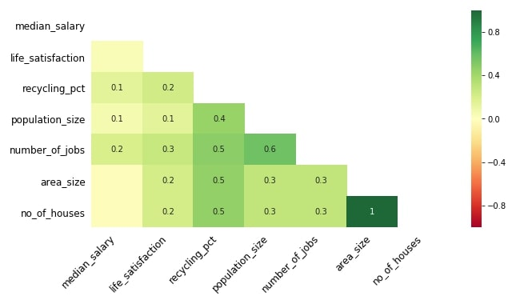</td>
    <td align="center"><strong>Matrix</strong><br>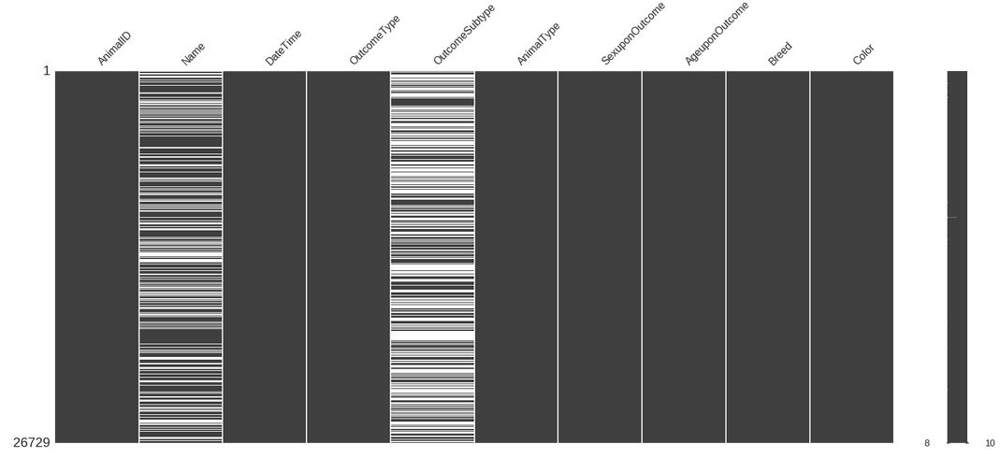</td>
  </tr>
</table>


## <h1 align="center">__outliers_detection()__</h1>

<p align="center" , style="font-size:20px;">

| Parameter | Type | Default | Description |
|----------|------|--------|-------------|
| ascending | bool | False | Sort the outlier summary table ascending or descending |
| box_plot | bool | False | Whether to display a box plot for visualizing outliers |

</p>

```python
#python Example
outliers_detection(ascending=False,
                    box_plot=False
                    )
```
<table>
  <tr>
    <td align="center"><strong>Box Plot</strong><br></td>
  </tr>
</table>

## <h1 align="center">__visualize_data()__</h1>
<p align="center" , style="font-size:20px;">

| Parameter | Type | Default | Description |
|----------|------|--------|-------------|
| target_col | str / None | None | Column name to use as target for scatter plots |
| scatter_with_target | bool | False | Whether to show scatter plots with the target column |
| histogram | bool | False | Whether to display histograms for all features |
| correlation_heatmap | bool | False | Whether to display a correlation heatmap |
| box_plot | bool | False | Whether to display box plots for all features |
| scatter_matrix | bool | False | Whether to display scatter matrix of features |
| pair_plot | bool | False | Whether to display pair plot of features |
| figsize | tuple | (10,6) | Figure size for all plots (width, height) |
| fontsize | int | 12 | Font size for plot titles and labels |
| bins | int | 30 | Number of bins for histogram plots |
| correlation_method | str | 'pearson' | Method for correlation calculation ('pearson', 'spearman', etc.) |
</p>

```python
visualize_data(target_col=None,
                       scatter_with_target=False ,
                       histogram=False , 
                       correlation_heatmap=False  ,
                       box_plot=False  ,
                       scatter_matrix=False  ,
                       pair_plot=False ,
                       figsize=(10,6) ,
                       fontsize=12,
                       bins=30,
                       correlation_method='pearson'
                       )
```
<table>
  <tr>
    <td align="center"><strong>Heat Map</strong><br>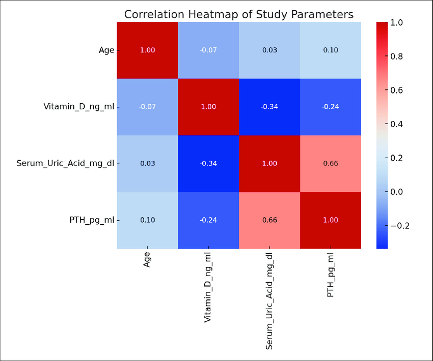</td>
    <td align="center"><strong>Scatter Plot</strong><br>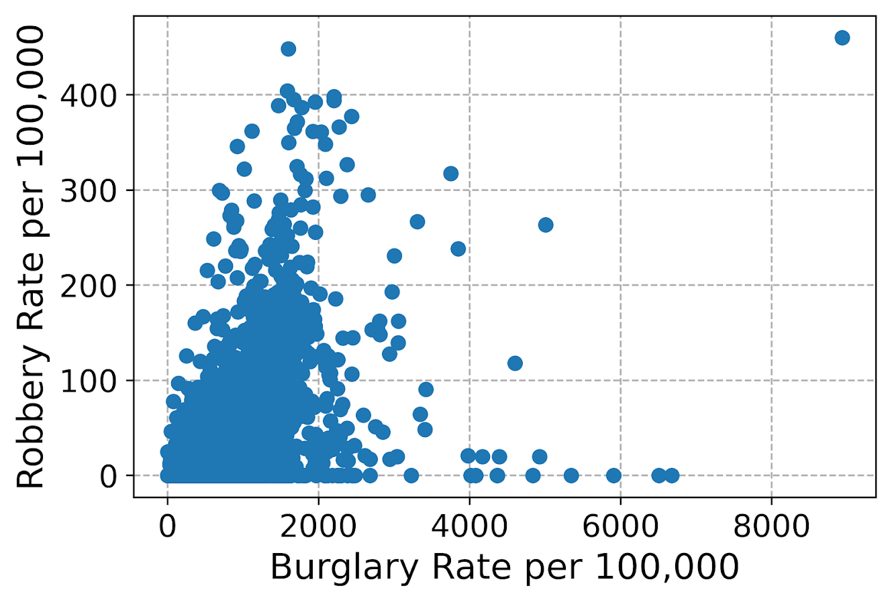</td>
  </tr>
</table>

## <h1 align="center">__handle_missing_values()__</h1>

<p align="center" , style="font-size:20px;">

| Parameter | Type | Default | Description |
|----------|------|--------|-------------|
| drop_threshold | float | 0.5 | Threshold for dropping columns with missing values (fraction of missing allowed) |
| impute_strategy | str | 'mean' | Strategy for imputing missing values ('mean', 'median', 'mode') |
| dtype_specific | str | 'auto' | Whether to apply strategy automatically based on dtype ('auto', 'numeric', 'categorical') |
</p>

```python
handle_missing_values(drop_threshold=0.5,
                              impute_strategy='mean',
                              dtype_specific="auto"
                              )
```
## <h1 align="center">__remove_outliers()__</h1>

<p align="center" , style="font-size:20px;">

| Parameter | Type | Default | Description |
|----------|------|--------|-------------|
| technique | str | 'iqr' | Method to detect outliers ('iqr', 'z-score', 'percentile') |
| before_after | bool | True | Whether to show dataset statistics before and after removing outliers |
| box_plot | bool | True | Whether to display box plots to visualize outliers before & after |
| apply | bool | False | Whether to actually apply the outlier removal |
| keep_cols | list | [] | List of columns to keep even if they contain outliers |
</p>

<table>
  <tr>
    <td align="center"><strong>Box Plot</strong><br>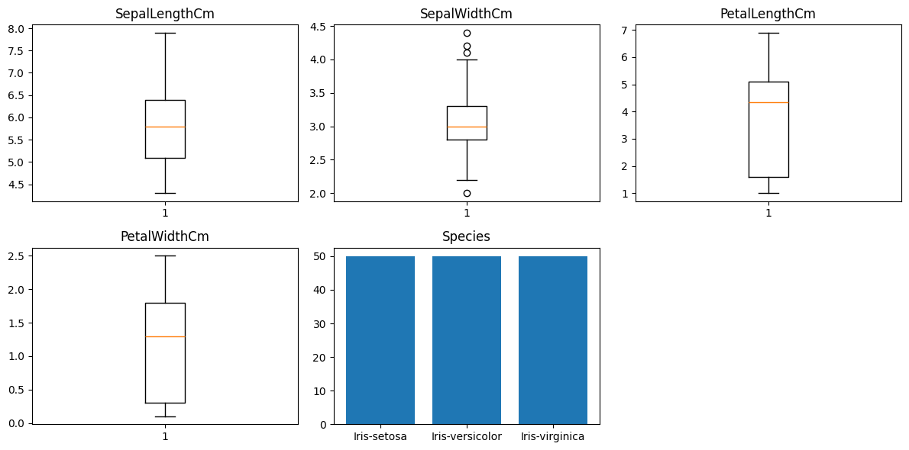</td>
  </tr>
</table>

```python
remove_outliers(technique='iqr',
                before_after=True, 
                box_plot=True , 
                apply=False , 
                keep_cols=[])
```


## <h1 align="center">__scaling_features()__</h1>

<p align="center" , style="font-size:20px;">

| Parameter | Type | Default | Description |
|----------|------|--------|-------------|
| scaling_method | str | 'standard' | Scaling method to apply ('standard', 'min_max', 'robust') |
| before_after | bool | True | Whether to display feature distributions before and after scaling |
| kde_plot | bool | True | Whether to display KDE plots to visualize feature distributions |
| fit | bool | True | Whether to fit the scaler to the training data (set False to only transform) |
</p>

<table>
  <tr>
    <td align="center"><strong>Box Plot</strong><br>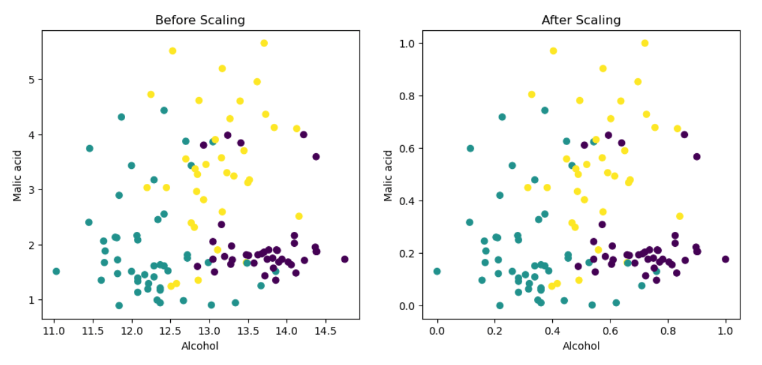</td>
  </tr>
</table>

```python
scaling_features(scaling_method='standard',
                    before_after=True,
                    kde_plot=True,
                    fit=True)
```


## <h1 align="center">__handle_skewness()__</h1>

<p align="center" , style="font-size:20px;">

| Parameter | Type | Default | Description |
|----------|------|--------|-------------|
| method_skewness | str | 'auto' | Method to correct skewness ('auto', 'log', 'sqrt', 'box-cox', 'yeojohnson') |
| threshold | float | 0.7 | Skewness threshold above which the correction will be applied |
| before_after | bool | True | Whether to display feature distributions before and after skewness correction |
| kde_plot | bool | True | Whether to display KDE plots to visualize feature distributions |
</p>

<table>
  <tr>
    <td align="center"><strong>Skewness Kde</strong><br></td>
  </tr>
</table>

```python
handle_skewness(method_skewness='auto',
                    threshold=0.7,
                    before_after=True,
                    kde_plot=True)
```

## <h1 align="center">__encode_categorical_variables()__</h1>

<p align="center" , style="font-size:20px;">

| Parameter | Type | Default | Description |
|----------|------|--------|-------------|
| one_hot_encoding_cols | list / None | None | List of columns to apply One-Hot Encoding (converted internally to empty list if None) |
| label_encoding_cols | list / None | None | List of columns to apply Label Encoding (converted internally to empty list if None) |
| encoding_method | str | 'auto' | Encoding method to use automatically if columns are not specified ('auto', 'onehot', 'label', 'ordinal') |
| ordinal_encoding_cols | dict / None | None | Dictionary specifying columns and their custom order for Ordinal Encoding (converted internally to empty dict if None) |
</p>

<table>
  <tr>
    <td align="center"><strong>encoding Features</strong><br>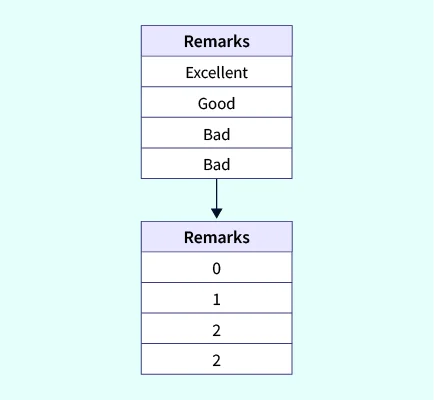</td>
  </tr>
</table>

```python
encode_categorical_variables(one_hot_encoding_cols=None ,
                                label_encoding_cols=None ,
                                encoding_method='auto',
                                ordinal_encoding_cols=None
 )
```

## <h1 align="center">__split_data()__</h1>

<p align="center" , style="font-size:20px;">

| Parameter | Type | Default | Description |
|----------|------|--------|-------------|
| test_size | float | 0.2 | Fraction of the dataset to use as the test set |
| random_state | int | 42 | Random seed for reproducibility |
| shuffle | bool | True | Whether to shuffle the data before splitting |
| classification | bool | False | Whether the task is classification (affects stratified sampling) |
</p>

<table>
  <tr>
    <td align="center"><strong>Split Data</strong><br>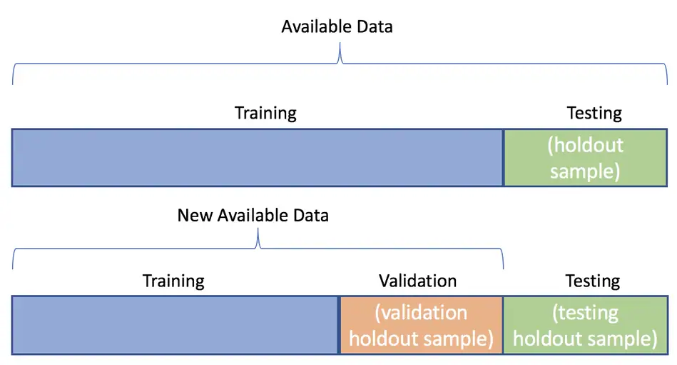</td>
  </tr>
</table>

```python
split_data (test_size=0.2 ,
                random_state=42 ,
                shuffle=True ,
                classification=False )
```

## <h1 align="center">__imbalance_handling()__</h1>

<p align="center" , style="font-size:20px;">

| Parameter | Type | Default | Description |
|----------|------|--------|-------------|
| method | str | 'smote_tomek' | Method to handle imbalance ('smote', 'undersample', 'smoteenn', 'tomek', 'smote_tomek') |
| random_state | int | 42 | Random seed for reproducibility |
| sampling_strategy | str | 'auto' | Sampling strategy for resampling methods ('auto', float, dict, etc.) |
| k_neighbors | int | 5 | Number of neighbors for SMOTE-based methods |
| n_jobs | int | -1 | Number of parallel jobs for undersampling methods |
| tomek_ | object / None | None | Custom TomekLinks object (optional) |
| count_plot | bool | True | Whether to visualize class distribution before and after |
| apply | bool | False | Whether to actually apply the imbalance handling |
</p>

<table>
  <tr>
    <td align="center"><strong>Imbalance Data</strong><br>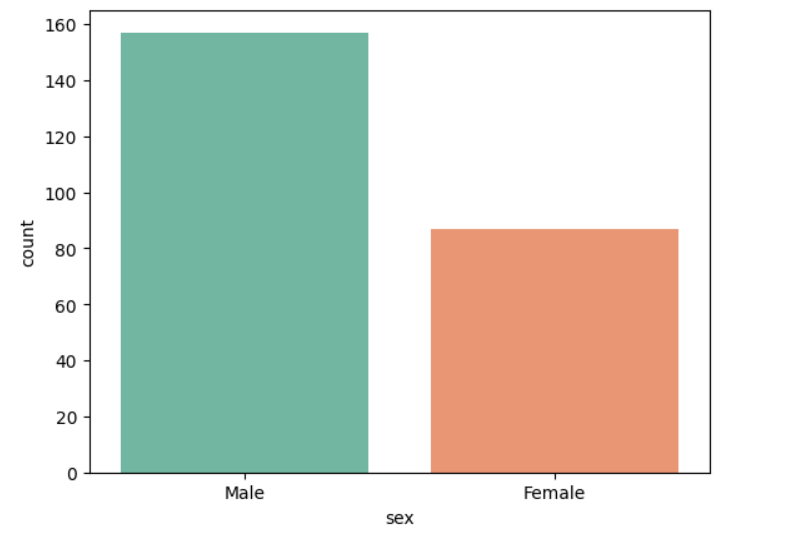</td>
  </tr>
</table>

```python
imbalance_handling(method='smote_tomek' ,
                        random_state=42 ,
                        sampling_strategy='auto' ,
                        k_neighbors=5 ,
                        n_jobs=-1 ,
                        tomek_=None ,
                        count_plot=True ,
                        apply=False )
```

## <h1 align="center">__feature_selection()__</h1>

<p align="center" , style="font-size:20px;">

| Parameter | Type | Default | Description |
|----------|------|--------|-------------|
| method | str | 'rfe' | Feature selection method ('rfe', 'variance_threshold', 'correlation', 'lasso') |
| threshold | float | 0.0 | Threshold for filtering features (used in 'variance_threshold' and 'correlation' methods) |

</p>

<table>
  <tr>
    <td align="center"><strong>Feature Selection</strong><br>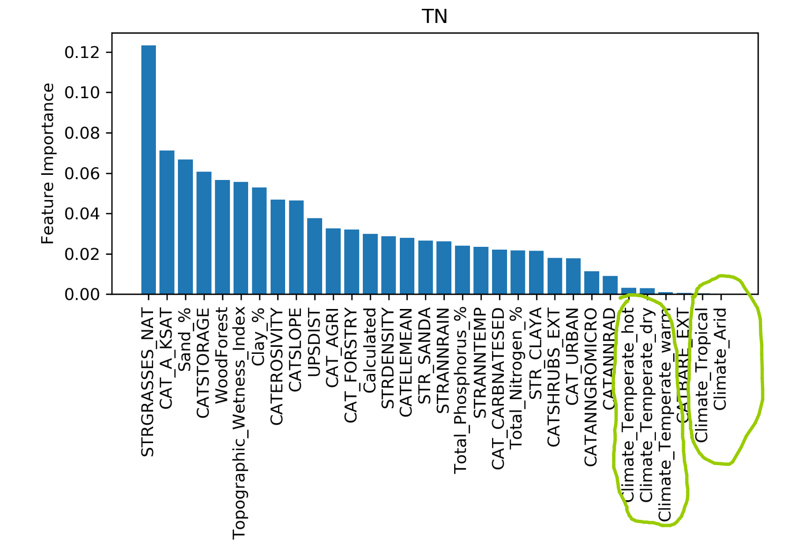</td>
  </tr>
</table>

```python
feature_selection(method='rfe',
                    threshold=0.0 )
```

## <h1 align="center">__pca()__</h1>

<p align="center" , style="font-size:20px;">

| Parameter | Type | Default | Description |
|----------|------|--------|-------------|
| apply | bool | False | Whether to actually apply PCA |
| n_components | int | 2 | Number of principal components to keep |
| scatter_plot | bool | True | Whether to plot the first two principal components (requires n_components >= 2) |

</p>

<table>
  <tr>
    <td align="center"><strong>PCA</strong><br>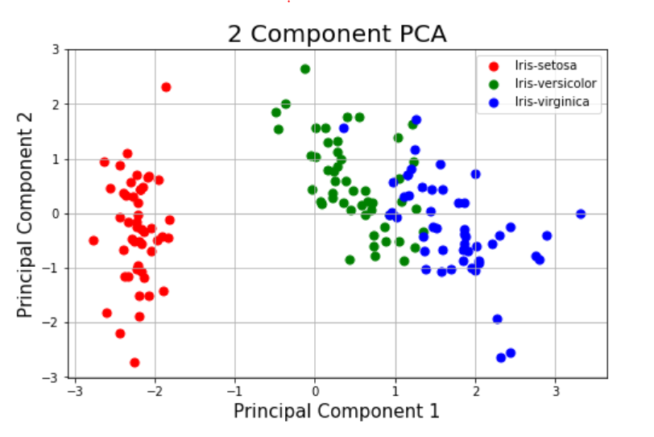</td>
  </tr>
</table>

```python
pca(apply=False,
        n_components=2,
        scatter_plot=True )
```

## <h1 align="center">__model_selection()__</h1>

<p align="center" , style="font-size:20px;">

| Parameter | Type | Default | Description |
|----------|------|--------|-------------|
| models_dict | dict | None | Dictionary of models to evaluate, e.g., {"Linear Regression": lr_model, "RF": rf_model} |
| scoring | str | 'r2' | Metric used to evaluate models (e.g., 'r2', 'accuracy', 'neg_mean_squared_error') |
| cv | int | 5 | Number of cross-validation folds |
| n_jobs | int | -1 | Number of parallel jobs for cross-validation (-1 uses all cores) |
| print_results | bool | True | Whether to print cross-validation scores and summary |
| ascending | bool or None | None | Whether to sort models ascending (errors) or descending (scores); default auto based on metric |

</p>

<table>
  <tr>
    <td align="center"><strong>Cross Validation</strong><br>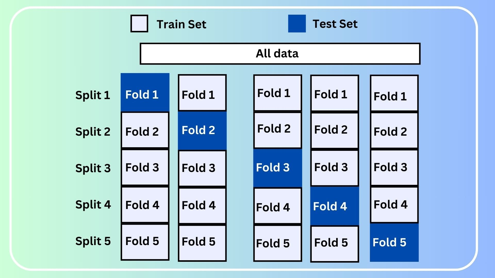</td>
  </tr>
</table>

```python
model_selection(models_dict,
                    scoring="r2",
                    cv=5,
                    n_jobs=-1,
                    print_results=True,
                    ascending=None
)
```
## <h1 align="center">__preprocess_data()__</h1>
<p>
The <strong>preprocess_data()</strong> function is a complete preprocessing pipeline that cleans, transforms, and prepares your dataset for machine learning. 
It handles missing values, outliers, scaling, skewness, categorical encoding, splitting, imbalance, feature selection, and optional PCA.
</p>

```python
preprocess_data(X_new=None,
                    classification=False,
                    remove_outliers=True,
                    handle_missing=True,
                    scaling=True,
                    handle_skewness=True,
                    encode_categorical=True,
                    split=True,
                    imbalance_handling=False,
                    feature_selection=True,
                    pca=False,
                    polynomial_feature= False,
                    visualization=True,
                    # handle_missing_values
                    drop_threshold=0.5,
                    impute_strategy="mean",
                    dtype_specific="auto",
                    # remove_outliers
                    technique="iqr",
                    before_after_outliers=True,
                    box_plot=True,
                    # scaling_features
                    scaling_method="min_max",
                    before_after_scaling=True,
                    kde_plot_scaling=True,
                    fit=True,
                    # handle_skewness
                    method_skewness="auto",
                    threshold_skewness=0.4,
                    before_after_skew=True,
                    kde_plot_skew=True,
                    # encode_categorical_variables
                    one_hot_encoding_cols=None,
                    label_encoding_cols=None,
                    encoding_method="auto",
                    ordinal_encoding_cols=None,
                    # split_data
                    test_size=0.2,
                    random_state=42,
                    shuffle=True,
                    # imbalance_handling
                    method_imbalance="smote",
                    sampling_strategy="auto",
                    k_neighbors=5,
                    n_jobs=-1,
                    tomek_=None,
                    # feature_selection
                    method_selection="variance_threshold",
                    threshold_selection=0.0,
                    # PCA
                    n_components_pca=2,
                    scatter_plot_pca=True,
                    apply_pca=False
)
```

## <h1 align="center">__model_Training_evaluation()__</h1>

<p align="center" , style="font-size:20px;">

| Parameter | Type | Default | Description |
|----------|------|--------|-------------|
| models_dict | dict | None | Dictionary of models to evaluate, e.g., {"Linear Regression": lr_model} |
| classification | bool | False | Whether the task is classification (True) or regression (False) |
| accuracy | bool | True | Show accuracy for classification |
| precision | bool | True | Show precision for classification |
| recall | bool | True | Show recall for classification |
| f1_score | bool | True | Show F1 score for classification |
| Mean_Squared_Error | bool | True | Show MSE for regression |
| Mean_Absolute_Error | bool | True | Show MAE for regression |
| R2_Score | bool | True | Show R² score for regression |
| Mean_Absolute_Percentage_Error | bool | True | Show MAPE for regression |
| Root_Mean_Squared_Error | bool | True | Show RMSE for regression |
| confusion_matrix | bool | True | Show confusion matrix for classification |
| classification_report | bool | True | Show classification report for classification |

</p>

<table>
  <tr>
    <td align="center"><strong>Training & Evaluation Model</strong><br>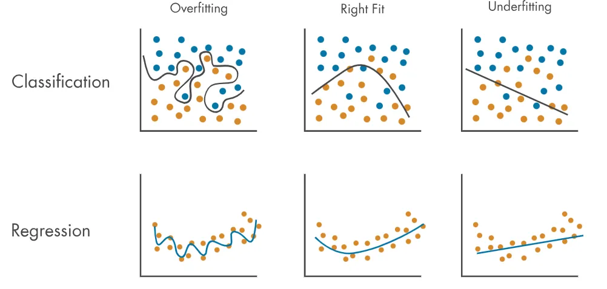</td>
  </tr>
</table>

```python
model_Training_evaluation(models_dict ,
                            classification=False,
                            accuracy=True ,
                            precision=True ,
                            recall=True ,
                            f1_score=True ,
                            Mean_Squared_Error=True ,
                            Mean_Absolute_Error=True ,
                            R2_Score=True ,
                            Mean_Absolute_Percentage_Error=True ,
                            Root_Mean_Squared_Error=True ,
                            confusion_matrix=True ,
                            classification_report=True
)
```

## <h1 align="center">__model_prediction()__</h1>

<p align="center" , style="font-size:20px;">

| Parameter | Type | Default | Description |
|----------|------|--------|-------------|
| model | object | None | Trained model to use for prediction |
| X_new | int, float, list, np.ndarray, pd.DataFrame | None | New input data for prediction |
| apply_scaling | bool | True | Whether to apply scaling to numeric features |
| scaling_method | str | None | Scaling method to apply (if None, uses previously fitted method or 'min_max') |

</p>

<table>
  <tr>
    <td align="center"><strong>Training & Evaluation Model</strong><br></td>
  </tr>
</table>

```python
model_prediction(model,
                    X_new,
                    apply_scaling=True,
                    scaling_method=None
)
```

## <h1 align="center">__model_save()__</h1>

<p align="center" , style="font-size:20px;">

| Parameter | Type | Default | Description |
|----------|------|--------|-------------|
| model | object | None | Trained model to save |
| filename | str | None | File path to save the model (if None, saves as 'model.joblib') |
</p>

```python
 model_save( model ,
                filename
)
```

## <h1 align="center">__model_visualization()__</h1>

<p align="center" , style="font-size:20px;">

| Parameter | Type | Default | Description |
|----------|------|--------|-------------|
| models_dict | dict | None | Dictionary of trained models to visualize (`{model_name: model_object}`) |
| feature_names | list | None | Names of features (optional, for labeling if needed) |
| classification | bool | False | Set to True for classification tasks, False for regression |

</p>

```python
 model_visualization(models_dict ,
                        feature_names=None ,
                        classification=False
)
```


## Class Structure

Main class:

```
MachineLearning
```

Key methods:
```python
display_data()
null_values()
visualize_data()
handle_missing_values()
remove_outliers()
scaling_features()
encode_categorical_variables()
split_data()
imbalance_handling()
feature_selection()
pca()
preprocess_data()
model_selection()
model_Training_evaluation()
model_prediction()
model_save()
model_visualization()
```
---

## Example Usage

```python
df = pd.read_csv("Heart Disease Dataset.csv")
project = MachineLearning(df=df , target='target' , classification=True)
project.display_data()
project.handle_missing_values(impute_strategy="median")
project.outliers_detection(box_plot=True)
project.scaling_features(scaling_method="standard")
project.handle_skewness(threshold=0)
project.split_data(classification=True , test_size=0.2 , random_state=85)
project.imbalance_handling(apply=True ,method="smote")
project.pca(apply=False)
project.visualize_data(histogram=True)

logR = LogisticRegression(
    solver='saga',
    penalty='elasticnet',
    l1_ratio=0.8,
    C=0.23,
    max_iter=1000
)

models_dict = {
    "Logistic Regression": logR
}

project.model_selection(models_dict=models_dict, print_results=True , ascending=True ,scoring="accuracy" , cv=5)
project.model_Training_evaluation(models_dict=models_dict , classification=True , classification_report=True)
project.model_visualization(models_dict=models_dict , classification=True)
```

## Libraries Used

* pandas
* numpy
* matplotlib
* seaborn
* scikit-learn
* imbalanced-learn
* missingno
* scipy
* math
* warnings
* joblib

---